## Baggage information bot:

The Baggage information bot will help Airline staff complete the following tasks:

* Check baggage status
* Track current location
* Re-assign baggage
* Report missing baggage

This is applicable in scenarios when passengers inquire about their baggage status or when there is a need to reassign baggage when a passenger is rebooked on another flight due to reasons like flight overbooking, passenger unfit to fly, etc.

The data entered in each input box is marked as “Ex” in the instance below.

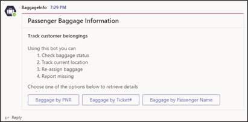

 Once the user starts interacting with the “BaggageInfo ” Bot, the above message will be populated on the screen. 

It displays three options for the user: “Baggage by PNR”, Baggage by Ticket#”, and “Baggage by Passenger Name”

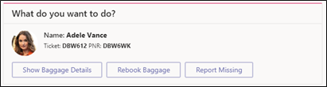

Once the Baggage by PNR is selected, Bot provides three options to the user. Clicking on Show Baggage Details, below screen will be displayed: 

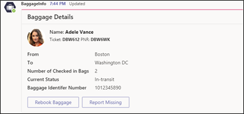

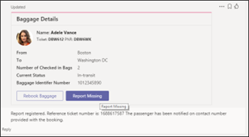

Two options are provided to the user: “Rebook Baggage” and “Report Missing, clicking on “Report Missing” will display the information.

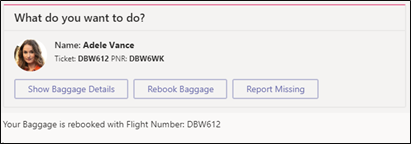

Clicking on “Rebook Baggage” will display the flight information on which the baggage has been reassigned.

## Fleet Information:

The information generated by the Fleet bot is used to assign an aircraft for an upcoming flight schedule. It gives a complete view of the fleet that the carrier owns and helps manage them. You can assign an aircraft to a scheduled flight route or mark the aircraft grounded for repair and maintenance. The data to be entered in each input box is marked as “Ex” in the instance below.
 
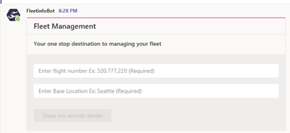

Providing the command ”@FleetInfoBot” will display the  above fields for data entry.

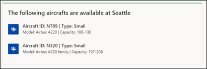

Entering the details like “Flight#” and “Base location” will let the user know the aircrafts available at the specific location as shown above:

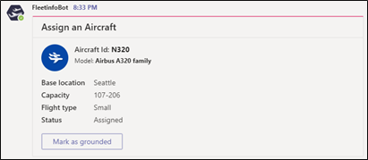

By clicking on “Mark as grounded” (above screenshot), the status of the aircraft will change from “Assigned” to “Grounded: (below screenshot).

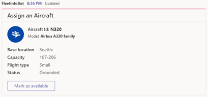

After flagging aircraft as “grounded”, the “Mark as available” option will be enabled.

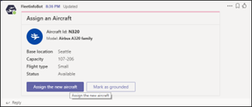

Once the aircraft has been flagged as “available”, “Assign the new aircraft” and “Mark as grounded” will be enabled again (above screenshot).

Clicking on “Assign the new aircraft” will change the status to “assigned” as shown in below screenshot.

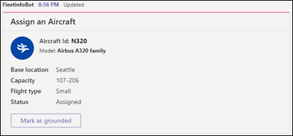

## Flight Information:

The Flight info bot offers insight into flight information such as destination, dates, and aircraft availability. This information can be used to rebook a passenger or to look up the travel details for a given flight. The data to be entered in each input box is marked as “Ex” in the instance below:
 
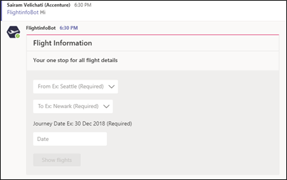

Above message and screen appears once the user starts the conversation  with the bot.

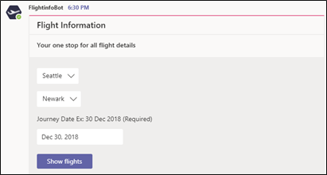

Enter the departure and arrival destinations and the initial trip date and click on “Show  flights”

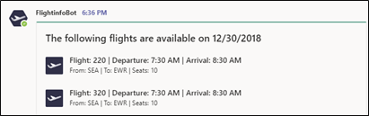

Flight options are displayed based on the inputs entered (shown in screenshot above).

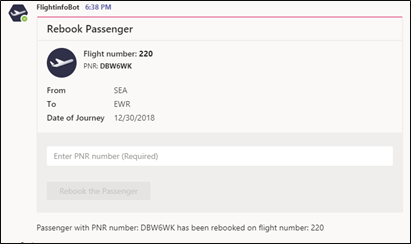

Upon click on any of the available flights, bot provides the details  of the flight and user needs to enter the PNR#. Once the PNR# is entered”, Rebook the Passenger” CTA is enabled. Click on the CTA and the passenger with the respective PNR will be rebooked on the selected flight.

## Passenger Information:

This application has a bot and message extension to look up details about passengers on a flight. It can help in various scenarios including looking up passengers requiring special assistance, those enrolled in loyalty programs, etc.
 
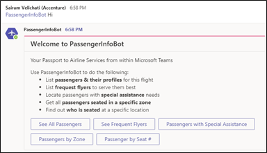
 
Above message and screen appears once the user initiates chat with “PassengerInfoBot”.  CTA options available for selection are: “See All Passengers”, “See Frequent Flyers”, “Passengers with Special Assistance”, “Passengers by Zone”, and ‘Passengers by Seat#”

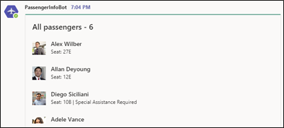

Given the user selected “See All Passengers”, bot displays the list of passengers in  the flight.

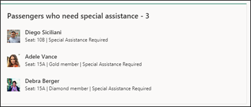

If the user is interested in seeing passenger details for those who require special assistance, they can select that option and the information will displayed (screenshot above).