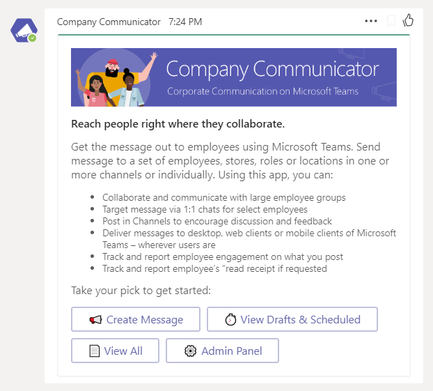
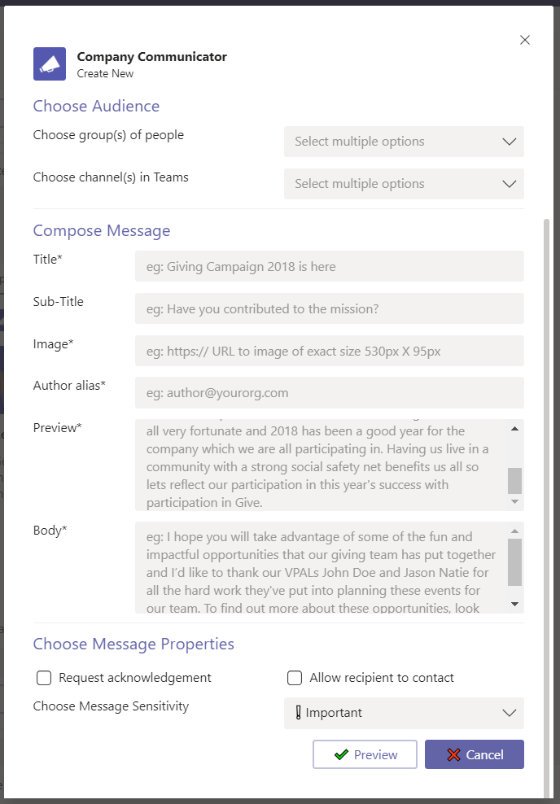
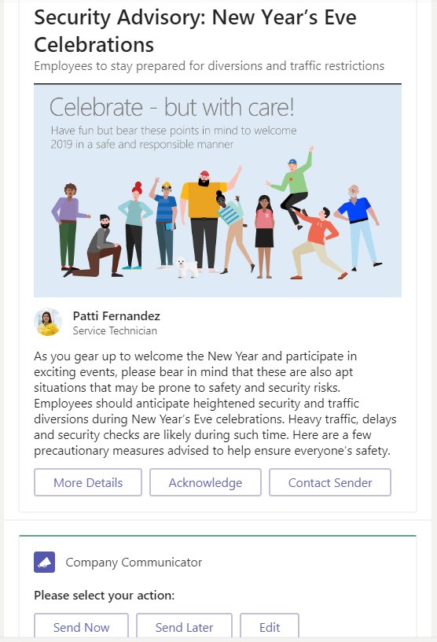
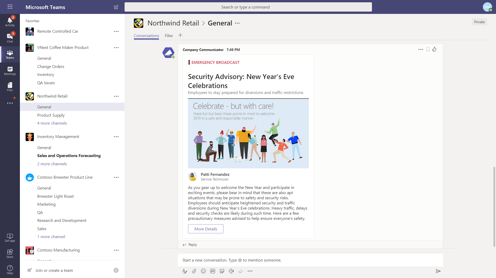
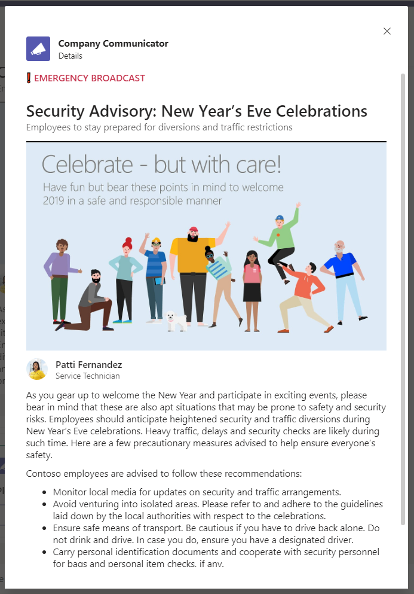

## Company Communicator App:

Scenario 1: Welcome

Start app interaction at the welcome screen

Scenario 2: Create Message

Creators / Moderators can create rich message from Create Message action button

Scenario 3: Preview and Send Message

Once the message is created, the same can be previewed before sending immediately or scheduled for later time.

Scenario 4: Message Delivery

Messages can be delivered in a channel or in 1:1 scope individually to all users in the audience or both.

Scenario 5: View Message

Full message can be viewed in detail and actions taken right inside Teams.

