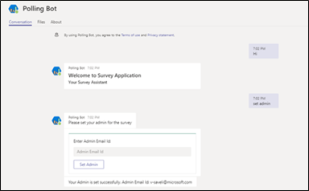
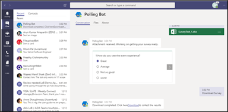
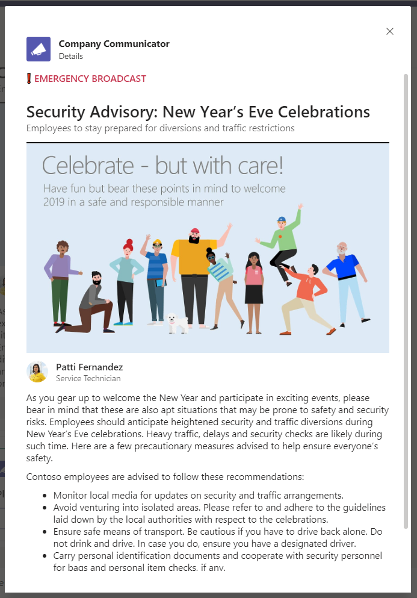

## Notification:

This application notifies select users when an event occurs. In this example, there are three types of notifications – weather update, operations delay and social events.

## Employee Survey / Poll:

Scenario 1: Setting an admin to publish a survey 

Enter the command "set admin" and in the following dialogue box, enter your email ID to get access to create and publish a survey. 

Scenario 2: Creating a survey 

This app supports only multiple-choice questions. The questions and the people to whom the survey should be published are shared with the bot as an Excel file. The sample Excel sheet is attached in the preview section for reference. 

Once you set an admin, when you initiate a conversation with the bot, it gives you options to create a survey, download the results of a survey, or even send a reminder to those who have not filled the survey yet.

Choose “Create Survey” and share the Excel spreadsheet with details of questions, answer options, and members to whom this survey should be pushed out. The survey will be sent as a notification only if the app is pre-installed by the user. 

As soon as the Excel file is received by the bot, it shows format of the questions extracted from the spreadsheet and, upon verification, you can publish the survey.

Scenario 3: End users receiving the survey

When you publish the survey, the users who have been mentioned in the Excel spreadsheet will receive a notification and a rich card with the survey that they should complete and submit.

Scenario 4: Downloading the results of a survey

Upon the admin invoking the app again with a 'Hi', the option to download the survey is made available.

The survey results are collated and delivered in an Excel file, which can then be used to create a Power BI.

## Company Communicator App:

Scenario 1: Create Message

Scenario 2: Creating a survey 

This app supports only multiple-choice questions. The questions and the people to whom the survey should be published are shared with the bot as an Excel file. The sample Excel sheet 

Scenario 5: Sending Reminder

The app checks for members who have not filled the survey and will send reminders to them.

## Company Communicator App:

Scenario 1: Welcome

Start app interaction at the welcome screen

Scenario 2: Create Message

Creators / Moderators can create rich message from Create Message action button

Scenario 3: Preview and Send Message

Once the message is created, the same can be previewed before sending immediately or scheduled for later time.

Scenario 4: Message Delivery

Messages can be delivered in a channel or in 1:1 scope individually to all users in the audience or both.

Scenario 5: View Message

Full message can be viewed in detail and actions taken right inside Teams.

