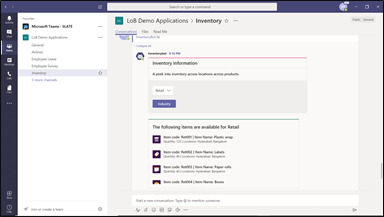
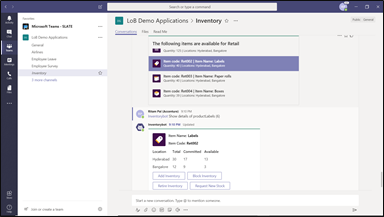
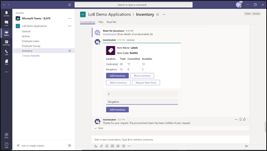

## Inventory bot

Scenario 1: View inventory List  

The bot lets the user choose an industry and display the relevant inventories available across different locations. 

Scenario 2: Check product details  

Choose a product from the inventory list to view its details. The bot displays quantity of product in stock along with certain actions the user can take (block inventory, add inventory, re-order inventory).

Scenario 3: Perform inventory updates  

The bot allows user to specify required quantity and location where the inventory change is to be done. The bot updates the changes and refreshes the card to show new quantities

