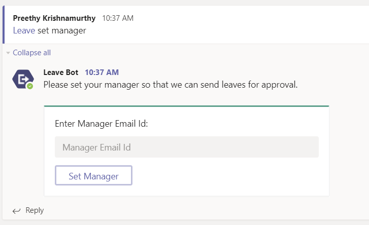
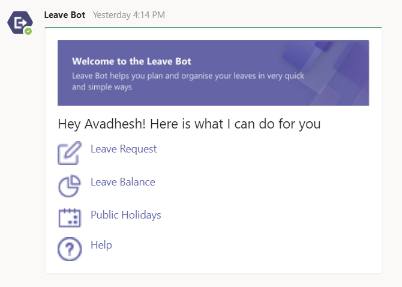
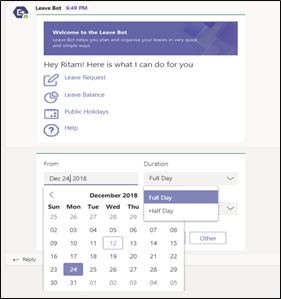
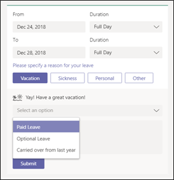
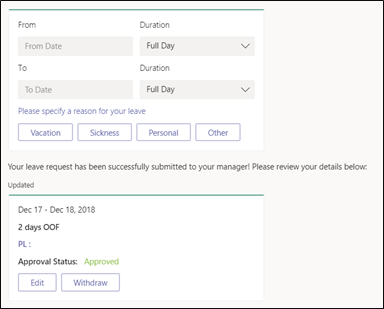
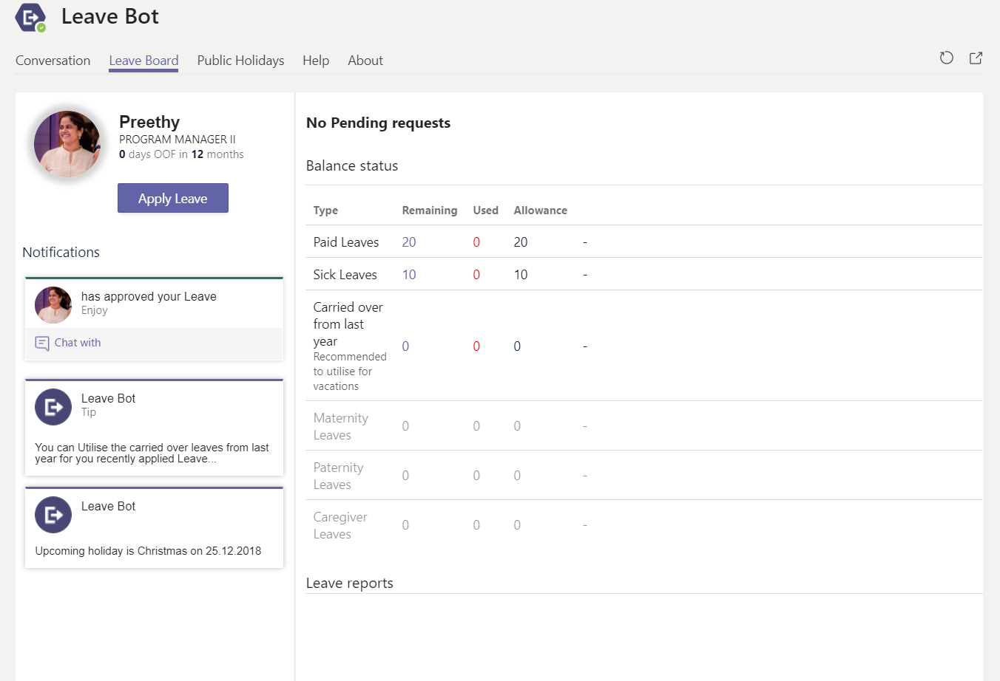
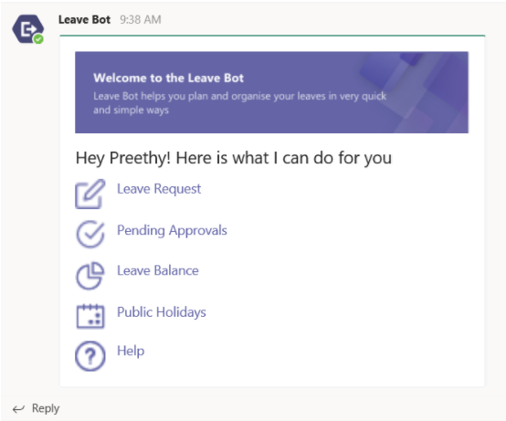
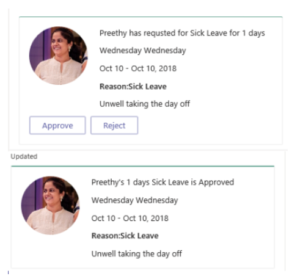
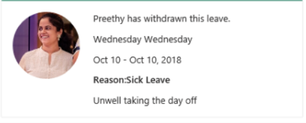
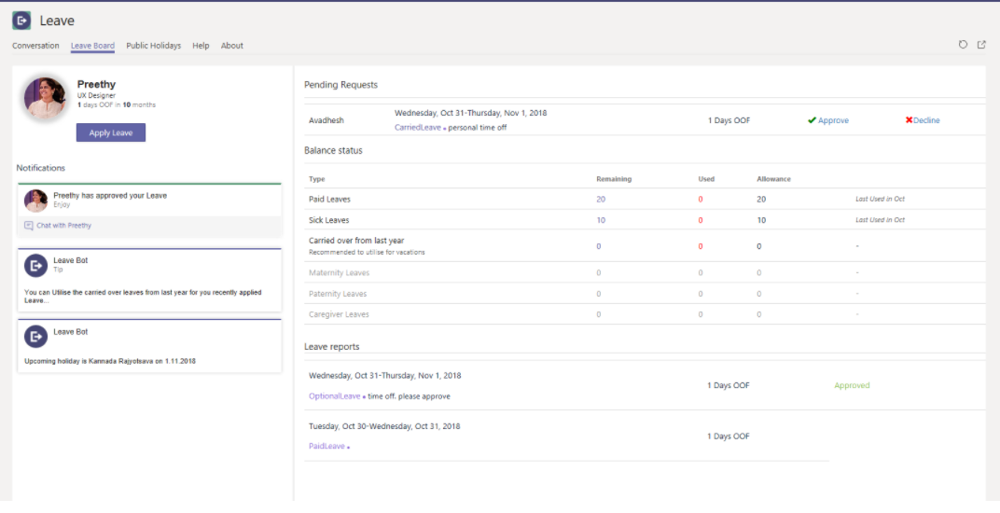

## Employee Leave App

This application has a bot and tabs that enable employees and managers to complete the entire flow needed for requesting and approving time off.

Employee workflow

Scenario 1: Set manager 

Enter the bot command as “set manager” and share the manager’s email ID. This allows the manager to receive notifications when a new request is submitted to them and go through the workflow for approval. 

Scenario 2: Apply for a leave

Ping “hi” to the bot and it will display an adaptive card with the options below. Choose “Leave request”.

To choose a type of leave, refresh the card to gather additional information and pre-populate the kind of leave in the drop down. For example, when you choose sickness, the dropdown option shows only “sick leave” or when you choose vacation/personal, the options provided are “personal leave”, “optional leave”, etc. 

Upon submitting the request, a confirmation message comes up with options to edit or withdraw. A notification also goes out to the manager. 

When the manager approves the leave, the same card is refreshed to reflect the status.

If you choose to withdraw the leave, the card is refreshed for both you and the manager that the request has been withdrawn. If you want to edit the card, it pulls up a task module to make changes.

Scenario 3: Personal leave board 

This board gives a quick overview of everything related to one's history of leave requests, status, etc.
 

Manager Workflow

Scenario 1: This is the main bot card, now including the option to view pending PTO approvals. This will also reflect in the Leave Board tab.

 
 

Scenario 2: Approving / rejecting a leave request

When an employee makes a new request, a notification comes to the manager and a rich card is presented for approval / reject action. The approval / reject action is updated for the employee, too, as shown in the flow above.
 

 
When the employee withdraws the leave request, the same card is updated to reflect the same too

 
 
Scenario 3: Personal Leave board

This  board gives a quick overview of one's history of leave requests, status, etc. Go to the personal scope of the app from the left rail and pin a tab to see this view. For managers, pending requests are also shown.
 

